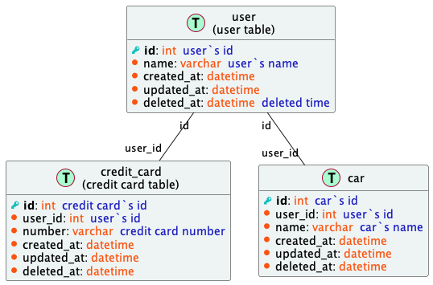

# ddl2plantuml

ddl2plantuml is a tool to generate plantuml ER diagram from database ddl.

### Supported database

- [x] mysql

### Installation

[Release](https://github.com/whoisix/ddl2plantuml/releases)

### Usage

```sh
$ ddl2plantuml -h                                                                                                               (1s)[0:30:06] 
NAME:
   ddl2plantuml - Convert DDL to PlantUML

USAGE:
   ddl2plantuml [global options] command [command options] [arguments...]

VERSION:
   v0.0.1

DESCRIPTION:
   ddl2plantuml is a tool to generate plantuml ER diagram from database ddl.

COMMANDS:
   help, h  Shows a list of commands or help for one command

GLOBAL OPTIONS:
   --driver value, -d value    database driver (default: "mysql")
   --template value, -t value  plantuml template file
   --file value, -f value      ddl sql file, required
   --output value, -o value    output directory (default: ".")
   --help, -h                  show help (default: false)
   --version, -v               print the version (default: false)

```

### Quick start

create a sql file, for example:
```sql
create table example (
    id int not null auto_increment comment 'primary key of the example',
    name varchar(255) not null comment 'name of the example',
    description text not null comment 'description of the example',
    created_at datetime not null default current_timestamp comment 'creation date',
    updated_at datetime not null default current_timestamp on update current_timestamp comment 'last update date',
    primary key (id)
);
```

run the command:
```sh
$ ddl2plantuml -f example.sql
```
generate the plantuml file:
```plantuml
@startuml

table( example ) {
    primary_key( id ): type( int )  comment( "primary key of the example" ) 
    column( name ): type( varchar )  comment( "name of the example" ) 
    column( description ): type( text )  comment( "description of the example" ) 
    column( created_at ): type( datetime )  comment( "creation date" ) 
    column( updated_at ): type( datetime )  comment( "last update date" ) 
}

@enduml
```
screenshot  

